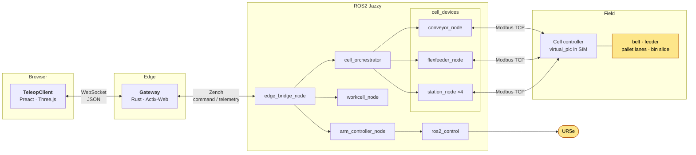

<div align="center">

# Web-Controlled Cobot Simulation

*based on [Universal Robots](https://www.universal-robots.com/products/ur5e/) UR5e*

`feat/conveyor-devices` · Unit 9 · *real-device conveyor cell*

</div>

---

## Overview

A **Universal Robots UR5e** cobot and a set of conveyor devices, all controlled through **ROS2 Jazzy** and operated from a web page. The browser sends only *intents* (Fill, Process, Stop). A ROS2 orchestrator turns them into device actions, and device nodes talk Modbus TCP to a cell controller. State flows back up the same path into a Three.js scene.



| Node / service | Runs as | Role |
|---|---|---|
| **TeleopClient** | Preact + Three.js app in the browser | Operator panel and 3D visualiser. Renders the cell from `cell_state` and the arm from joint telemetry |
| **Gateway** | Rust, Actix-Web | Validates every message, allows one operator session per robot, rate-limits commands, thins telemetry to about 30 Hz |
| **DataFabric** | Zenoh, with `zenoh-bridge-ros2dds` | Carries `robot/{id}/command` and `robot/{id}/telemetry`. Raw ROS2 traffic is never exposed to the network |
| **edge_bridge_node** | ROS2 (`arm_controller`) | Maps `CELL_FILL`, `CELL_PROCESS`, `CELL_STOP`, reset and emergency stop onto orchestrator services, and forwards `/cell/state` into telemetry |
| **cell_orchestrator** | ROS2 (`cell_orchestrator`) | Owns the flow: batches, sort cycles, exchanges. Commands the device nodes, never the reverse |
| **conveyor_node, flexfeeder_node, station_node ×4** | ROS2 (`cell_devices`) | One node per device: belt, feeder, three pallet lanes and the scrap bin slide. Each reads and writes registers through `pymodbus` |
| **virtual_plc** | ROS2 (`cell_devices`) | Simulated cell controller serving the same register map. Replaced by a real controller on hardware |
| **workcell_node, arm_controller_node** | ROS2 (`workcell_manager`, `arm_controller`) | Gearwheel inventory, and the `PickAndPlace` action with UR5e inverse kinematics |
| **ros2_control** | `scaled_joint_trajectory_controller`, UR driver | Executes the trajectory on the UR5e |

### This branch: ROS2-owned conveyor devices

A digital twin of a small factory unit. Earlier branches only *pretend* to feed the belt and empty the trays, inside the browser. Here every moving part is a ROS2-managed device modelled on hardware you can buy:

| In the unit | What it does | Real-world class of device |
|---|---|---|
| **Flexible feeder** | Holds 100 gearwheels, places them one at a time on the belt | RNA FlexType P |
| **Conveyor** | Carries gearwheels to the robot, stops at the pick zone, flushes leftovers | Dorner 2200 belt, VFD or BLDC drive |
| **Pallet lanes (×3)** | One per colour. A full tray (10 pockets) rolls out and an empty one comes back | Interroll RollerDrive |
| **Scrap bin exchange** | When the bin holds 20 broken parts, it slides out, tips, and returns | Festo DGC-K or SMC MY1 slide with tipper |
| **Cell controller** | Handles the fast reactions (stop belt at sensor, count parts) | WAGO PFC200 PLC |
| **UR5e arm** | Picks intact gearwheels and drops them in the right tray | Universal Robots UR5e |

**What the buttons do**

| Button | What happens |
|---|---|
| **Fill** | Loads the feeder with a shuffled deck of 100 gearwheels: 10 defective, plus 30 white, 30 green and 30 blue good ones. Available only while the feeder is empty and nothing is running |
| **Process** | Starts the belt and the feeder. The belt stops when the first intact gearwheel reaches the pick-zone sensor. The arm then sorts that batch into the pallet of each colour, and the cycle repeats until the deck is empty. A last run flushes leftover defective parts into the scrap bin |
| **Stop** | The feeder stops placing, the belt runs on to the sensor, and the current pick and any pallet or bin exchange finish. Process picks up from there |
| **Emergency Stop** | Freezes the arm, belt, feeder, lanes and bin where they are, and ends the session. Reconnecting runs a flush reset that empties belt, pallets and bin |

Design rationale: [ADR 0006](docs/adr/0006-ros2-owned-conveyor-devices-and-field-io.md).

---

## Contents

1. [Branches at a glance](#branches-at-a-glance)
2. [Documentation](#documentation)
3. [Technology stack](#technology-stack)
4. [Hardware used in this branch](#hardware-used-in-this-branch)
5. [Estimated cost of a real setup](#estimated-cost-of-a-real-setup)
6. [Installation](#installation)
7. [Running it](#running-it)
8. [Testing](#testing)

---

## Branches at a glance

| Branch | Flow | Who drives the cell | Hardware in the model |
|---|---|---|---|
| [`main`](https://github.com/alexDou/ros2-robo-ctrl--simulation/tree/main) | **A: click-to-place.** Click the table, a gearwheel appears, the arm sorts it. | Operator clicks | UR5e + suction tool |
| [`feat/conveyor-flow`](https://github.com/alexDou/ros2-robo-ctrl--simulation/tree/feat/conveyor-flow) | **B: conveyor.** A belt brings batches; the arm sorts them automatically. | The web page (simulated belt) | UR5e + suction tool |
| [`feat/conveyor-devices`](https://github.com/alexDou/ros2-robo-ctrl--simulation/tree/feat/conveyor-devices) | **B on real devices.** Feeder, belt, pallets and bin are ROS2-managed devices. | ROS2 nodes over Modbus TCP | UR5e + the full device list below |

Each branch is self-contained. Exactly one flow per branch, no runtime switch.

---

## Documentation

| Topic | Where |
|---|---|
| Domain vocabulary (Gearwheel, Batch, Pallet, ...) | [`CONTEXT.md`](CONTEXT.md) |
| Roadmap of all units | [`docs_src/specs/units.md`](docs_src/specs/units.md) |
| **Unit 9 overview** (this branch) | [`docs_src/specs/unit9/overview.md`](docs_src/specs/unit9/overview.md) |
| Unit 9 layout, register map, decision log | [`docs_src/specs/unit9/implementation_wireframe.md`](docs_src/specs/unit9/implementation_wireframe.md) |
| Unit 9 hand-over notes | [`docs_src/specs/unit9/handoff_2026-10-07.md`](docs_src/specs/unit9/handoff_2026-10-07.md) |
| Unit 8 spec (conveyor flow) | [`docs_src/specs/unit8/overview.md`](docs_src/specs/unit8/overview.md) |
| Technologies | [`docs_src/specs/technologies.md`](docs_src/specs/technologies.md) |
| Working method | [`docs_src/specs/paradigm.md`](docs_src/specs/paradigm.md), [`AGENTS.md`](AGENTS.md) |

**Architecture decision records** (`docs/adr/`)

- [0001](docs/adr/0001-defer-gazebo-to-phase4-mock-motion-visualizer.md) Gazebo deferred, mock motion visualiser first
- [0002](docs/adr/0002-in-process-workcell-state-isolation.md) Workcell state isolation
- [0003](docs/adr/0003-analytical-ur5e-ik-and-event-driven-workcell.md) Analytical UR5e inverse kinematics
- [0004](docs/adr/0004-real-robot-ros2-native-architecture-and-gateway-throttling.md) Real-robot ROS2 architecture, 500 Hz to 30 Hz throttling
- [0005](docs/adr/0005-conveyor-branch-client-owned-feed-and-classification.md) Conveyor flow owned by the browser (partly superseded here)
- [**0006**](docs/adr/0006-ros2-owned-conveyor-devices-and-field-io.md) **ROS2-owned conveyor devices over Modbus TCP** (this branch)

---

## Technology stack

| Level | Language | Libraries and Tools |
|---|---|---|
| **TeleopClient** (`web/`) | TypeScript | Preact, Vite, Three.js, `urdf-loader`, Zod, Tailwind CSS · Vitest, Cucumber + Playwright · OXC (`oxlint`, `oxfmt`) |
| **Gateway** (`src/gateway/`) | Rust 2021 | Actix-Web, `actix-ws`, Tokio, **Zenoh**, Serde · `cargo nextest`, Clippy |
| **DataFabric** | n/a | Eclipse Zenoh pub/sub with `zenoh-bridge-ros2dds`; keys `robot/{id}/command`, `robot/{id}/telemetry` |
| **Arm control** (`arm_controller`, `robot_bringup`) | Python 3.12 | ROS2 Jazzy `rclpy`, `ros2_control`, Universal Robots driver and description, analytical UR5e IK |
| **Workcell** (`workcell_manager`) | Python | `rclpy`, ROS2 services and actions (`robot_control_interfaces`) |
| **Cell devices** (`cell_devices`, `cell_orchestrator`) | Python | `rclpy`, **`pymodbus`** (Modbus TCP), five nodes: Conveyor, FlexFeeder, Station ×4, Orchestrator, `virtual_plc` |
| **Contracts** (`schemas/`, `src/domain/`) | JSON Schema | One schema set, generated into Python, Rust and TypeScript by `scripts/generate_domain.py` |
| **Tooling** | Bash, Python | `uv`, `colcon`, Semgrep, `beans` issue tracker |

Rates: SIM runs the arm loop at 5 Hz; LIVE runs the UR5e at 500 Hz over RTDE. The Gateway always streams about 30 Hz to the browser. See [`.agents/rules/pipeline-rates.md`](.agents/rules/pipeline-rates.md).

---

## Hardware used in this branch

Everything below is **simulated by default**. The model names are the device *classes* the design is written for (see the decision log, D4, D16, D17).

| Part | Model / class | Motors and actuators | Signals |
|---|---|---|---|
| **Robot arm** | Universal Robots **UR5e**, 6 axes, 5 kg payload | 6 integrated joint modules (servo plus gearbox) | RTDE at 500 Hz, ROS2 driver |
| **Tool ("DexterousPalm")** | Pneumatic suction gripper | Vacuum ejector and valve | Controlled through the arm |
| **Flexible feeder** | RNA **FlexType P** (BVL-P hopper, FlexCube, EYE+ vision) | Vibration plate (3 axes), built-in picker | Modbus TCP, integrator-defined contract |
| **Conveyor** | Dorner **2200**-class cobot belt | AC gearmotor on a VFD (SINAMICS G120C, ABB ACS380) or BLDC (Oriental Motor BLV-R) | Encoder, photo-eye at the pick zone, photo-eye at the belt exit |
| **Pallet lanes ×3** | Roller lanes with a 2 × 5 nest tray pallet | **Interroll RollerDrive EC5000** (24 V brushless), MultiControl driver | Pallet-present sensors, stop gate |
| **Scrap bin exchange** | Festo **DGC-K** or SMC **MY1** rodless slide, Festo DSM / SMC CRB rotary tipper | Pneumatic (no electric motor) | End sensors, valves |
| **Cell controller** | **WAGO PFC200** class (CODESYS) with digital I/O and counter modules | n/a | Modbus TCP server, 5 Hz poll |
| **Safety** | PILZ PNOZ-class safety relay, belt-drive STO, pneumatics dump, UR safety I/O | n/a | Hardwired. The software Emergency Stop is *not* the safety function |

---

## Estimated cost of a real setup

> **Rough planning figures in USD, not quotes.** Prices are order-of-magnitude list prices for mid-2026 and vary by region, dealer and options. Mechanical frames, installation labour, taxes and shipping are mostly excluded. Treat the total as ±30 %.

| # | Device | Typical contents | Estimate (USD) |
|---|---|---|---:|
| 1 | **UR5e robot arm** | Arm, control box, teach pendant, mounting base | 38,000 |
| 2 | **Suction tool** | Vacuum gripper, ejector, fittings | 3,000 |
| 3 | **Flexible feeder** (RNA FlexType P class) | Hopper, vibration plate, vision, picker, controller | 45,000 |
| 4 | **Conveyor** | 1.5–2 m belt, gearmotor, VFD, encoder, two photo-eyes | 6,000 |
| 5 | **Pallet lanes ×3** (≈ 2,800 each) | Roller lane, RollerDrive, MultiControl, stop gate, sensors, nest-tray pallet | 8,400 |
| 6 | **Scrap bin exchange** | Rodless slide, rotary tipper, valves, sensors, bin | 3,000 |
| 7 | **Cell controller** | WAGO PFC200 plus DI, DO and counter modules | 2,400 |
| 8 | **Safety chain** | Safety relay, E-stops, basic guarding | 3,500 |
| 9 | **Compressed air** | Small compressor, filter-regulator-lubricator, tubing | 1,500 |
| 10 | **Electrical** | 24 V supplies, cabinet, switch, cabling | 2,000 |
| 11 | **Control PC** | Mini PC running ROS2, Gateway, web server | 1,200 |
| | **Hardware total** | | **≈ 114,000** |
| | Plausible range | | **85,000 – 150,000** |
| | Integration and commissioning (not included above) | 150–250 hours at typical rates | + 15,000 – 30,000 |

Where the money goes: the **feeder (≈ 40 %)** and the **arm (≈ 33 %)** are about three-quarters of the budget. Everything else together is less than a quarter. A cheaper first build could swap the feeder for a vibratory bowl or a manual tray loader.

---

## Installation

### Operating system and hardware

- **Ubuntu 24.04 LTS** (Noble). Tested on a Linux 7.x desktop. It also runs inside VirtualBox.
- 8 GB RAM minimum, 16 GB recommended, about 15 GB free disk.
- A browser with WebGL 2 (current Chrome, Chromium or Firefox).
- For real hardware only: a PREEMPT_RT kernel for the UR5e 500 Hz loop, and a network route to the arm and to the cell controller.

### Packages

```bash
# 1. ROS 2 Jazzy (follow https://docs.ros.org/en/jazzy/Installation.html), then:
sudo apt install -y \
  ros-jazzy-desktop ros-jazzy-ur ros-jazzy-ros2-control ros-jazzy-ros2-controllers \
  ros-jazzy-xacro ros-jazzy-robot-state-publisher \
  python3-colcon-common-extensions python3-pymodbus python3-pytest \
  build-essential git curl

# 2. Rust (1.78 or newer) and Cargo tools
curl --proto '=https' --tlsv1.2 -sSf https://sh.rustup.rs | sh
cargo install zenoh-bridge-ros2dds --locked
cargo install cargo-nextest --locked

# 3. Node.js 20 or newer (Node 24 works) and Python tooling
sudo apt install -y nodejs npm
curl -LsSf https://astral.sh/uv/install.sh | sh        # uv, Python >= 3.12
```

### Get and build the code

```bash
git clone https://github.com/alexDou/ros2-robo-ctrl--simulation.git
cd ros2-robo-ctrl--simulation
git checkout feat/conveyor-devices

# ROS2 workspace (the repo root is the colcon workspace)
source /opt/ros/jazzy/setup.bash
colcon build --symlink-install
source install/setup.bash

# Python deps (Zenoh client, pydantic, ...) and web deps
uv sync
npm --prefix web install

# Optional: regenerate cross-language types from schemas/
python3 scripts/generate_domain.py
```

---

## Running it

Open **three terminals** in the repository root, in this order:

```bash
# 1. ROS2: UR5e (fake hardware) + virtual PLC + all cell devices + orchestrator
./scripts/launch_ros2.sh

# 2. Gateway (also starts zenoh-bridge-ros2dds), listens on :8080
./scripts/launch_gateway.sh

# 3. Web app (Vite dev server)
./scripts/launch_teleop-client.sh
```

Then open **http://localhost:3000** and press **Connect**.

| Button | Effect |
|---|---|
| **Connect** | Starts a session and runs a visible flush reset (belt empties, trays exchange) |
| **Fill** | Loads the feeder with a 100-gearwheel deck |
| **Process** | Belt and feeder run; the arm sorts each batch |
| **Stop** | Finishes the current operation, then pauses. Process resumes it |
| **Emergency Stop** | Freezes the arm and every device, and ends the session |

Counters in the top-right corner of the 3D scene show the feeder stock, scrap bin count and the three pallet counts.

**Going live.** The same graph talks to real devices when you point it at them:

```bash
ros2 launch robot_bringup robot_nodes.launch.py \
  use_fake_hardware:=false robot_ip:=<UR5e IP> \
  controller_host:=<PLC IP> controller_port:=502
```

Real hardware needs a commissioned cell controller that exposes the register map in the [wireframe](docs_src/specs/unit9/implementation_wireframe.md), plus a hardwired safety chain.

---

## Testing

The repository uses one verification lane per system part. Run them **one at a time**, contracts first:

```bash
scripts/verify/status.sh          # which lanes your change touches
scripts/verify/contracts.sh
scripts/verify/gateway.sh
scripts/verify/edge.sh
scripts/verify/teleop-client.sh
scripts/verify/semgrep.sh
```

Each lane tests its part in isolation with mocks at the contract borders. The whole-system launch test (`scripts/verify/launch.sh`, about 8 minutes) is optional and only run on request.

---

## License

MIT. See [`LICENSE`](LICENSE).
