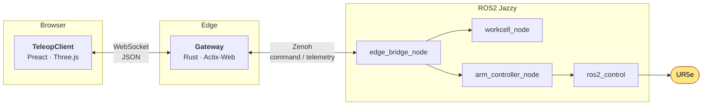

<div align="center">

# Web-Controlled Cobot Simulation

*based on [Universal Robots](https://www.universal-robots.com/products/ur5e/) UR5e*

`main` · *click-to-place (Flow A)*

</div>

---

## Overview

A **Universal Robots UR5e** cobot controlled through **ROS2 Jazzy** and operated from a web page. Commands travel from the browser through a Rust Gateway and a Zenoh data fabric into the ROS2 graph. Joint telemetry travels back the same way and drives a Three.js scene of the robot.



| Node / service | Runs as | Role |
|---|---|---|
| **TeleopClient** | Preact + Three.js app in the browser | Renders the UR5e from its URDF model and the work area in 3D, animates it from telemetry, and sends operator commands |
| **Gateway** | Rust, Actix-Web | The only door into the system: validates every message against the shared schemas, allows one operator session per robot, rate-limits commands, and thins the telemetry stream to about 30 Hz |
| **DataFabric** | Zenoh, with `zenoh-bridge-ros2dds` | Carries `robot/{id}/command` and `robot/{id}/telemetry` between the Gateway and ROS2. Raw ROS2 traffic is never exposed to the network |
| **edge_bridge_node** | ROS2 (`arm_controller`) | Translates commands into ROS2 services and actions, and joint states into telemetry events |
| **workcell_node** | ROS2 (`workcell_manager`) | Keeps the inventory: which gearwheel sits where, what is in each destination |
| **arm_controller_node** | ROS2 (`arm_controller`) | `PickAndPlace` action server: solves UR5e inverse kinematics and sends the trajectory |
| **ros2_control** | `scaled_joint_trajectory_controller`, UR driver | Executes the trajectory on the UR5e |

### This branch: click-to-place (Flow A)

A digital twin of a small factory unit. The operator clicks on the work table in the 3D view and a gearwheel appears there. The arm then does the rest on its own:

1. Plan a path to the gearwheel and pick it up.
2. Check it (colour: white, green or blue; about 1 in 5 is defective).
3. Carry a good one to the tower of its colour, or a defective one to the scrap bin.
4. Return to its home pose and wait for the next click.

Only one gearwheel is handled at a time. An always-visible **Emergency Stop** freezes the arm immediately.

> Want a conveyor belt? See [`feat/conveyor-flow`](https://github.com/alexDou/ros2-robo-ctrl--simulation/tree/feat/conveyor-flow). Want real feeder, belt and pallet devices? See [`feat/conveyor-devices`](https://github.com/alexDou/ros2-robo-ctrl--simulation/tree/feat/conveyor-devices).

---

## Contents

1. [Branches at a glance](#branches-at-a-glance)
2. [Documentation](#documentation)
3. [Technology stack](#technology-stack)
4. [Hardware used in this branch](#hardware-used-in-this-branch)
5. [Installation](#installation)
6. [Running it](#running-it)
7. [Testing](#testing)

---

## Branches at a glance

| Branch | Flow | Who drives the cell | Hardware in the model |
|---|---|---|---|
| **`main`** | **A: click-to-place.** Click the table, a gearwheel appears, the arm sorts it. | Operator clicks | UR5e + suction tool |
| [`feat/conveyor-flow`](https://github.com/alexDou/ros2-robo-ctrl--simulation/tree/feat/conveyor-flow) | **B: conveyor.** A belt brings batches; the arm sorts them automatically. | The web page (simulated belt) | UR5e + suction tool |
| [`feat/conveyor-devices`](https://github.com/alexDou/ros2-robo-ctrl--simulation/tree/feat/conveyor-devices) | **B on real devices.** Feeder, belt, pallets and bin are ROS2-managed devices. | ROS2 nodes over Modbus TCP | UR5e + feeder, belt, roller lanes, pneumatic bin slide, PLC |

Each branch is self-contained. Exactly one flow per branch, no runtime switch.

---

## Documentation

| Topic | Where |
|---|---|
| Domain vocabulary (Gearwheel, SpindleTower, ScrapBin, ...) | [`CONTEXT.md`](CONTEXT.md) |
| Roadmap of all units | [`docs_src/specs/units.md`](docs_src/specs/units.md) |
| Click-to-place workcell (Unit 5) | [`docs_src/specs/unit5/overview.md`](docs_src/specs/unit5/overview.md) |
| Autonomous pick and place (Unit 6) | [`docs_src/specs/unit6/overview.md`](docs_src/specs/unit6/overview.md) |
| Colour sorting and defect inspection (Unit 7) | [`docs_src/specs/unit7/overview.md`](docs_src/specs/unit7/overview.md) |
| Production ROS2 refactor | [`docs_src/specs/unit_refactoring-a/overview.md`](docs_src/specs/unit_refactoring-a/overview.md) |
| Technologies | [`docs_src/specs/technologies.md`](docs_src/specs/technologies.md) |
| Working method | [`docs_src/specs/paradigm.md`](docs_src/specs/paradigm.md), [`AGENTS.md`](AGENTS.md) |

**Architecture decision records** (`docs/adr/`)

- [0001](docs/adr/0001-defer-gazebo-to-phase4-mock-motion-visualizer.md) Gazebo deferred, mock motion visualiser first
- [0002](docs/adr/0002-in-process-workcell-state-isolation.md) Workcell state isolation
- [0003](docs/adr/0003-analytical-ur5e-ik-and-event-driven-workcell.md) Analytical UR5e inverse kinematics
- [0004](docs/adr/0004-real-robot-ros2-native-architecture-and-gateway-throttling.md) Real-robot ROS2 architecture, 500 Hz to 30 Hz throttling

---

## Technology stack

| Level | Language | Libraries and Tools |
|---|---|---|
| **TeleopClient** (`web/`) | TypeScript | Preact, Vite, Three.js, `urdf-loader`, Zod, Tailwind CSS · Vitest, Cucumber + Playwright · OXC (`oxlint`, `oxfmt`) |
| **Gateway** (`src/gateway/`) | Rust 2021 | Actix-Web, `actix-ws`, Tokio, **Zenoh**, Serde · `cargo nextest`, Clippy |
| **DataFabric** | n/a | Eclipse Zenoh pub/sub with `zenoh-bridge-ros2dds`; keys `robot/{id}/command`, `robot/{id}/telemetry` |
| **Arm control** (`arm_controller`, `robot_bringup`) | Python 3.12 | ROS2 Jazzy `rclpy`, `ros2_control`, Universal Robots driver and description, analytical UR5e IK |
| **Workcell** (`workcell_manager`) | Python | `rclpy`, ROS2 services and actions (`robot_control_interfaces`) |
| **Contracts** (`schemas/`, `src/domain/`) | JSON Schema | One schema set, generated into Python, Rust and TypeScript by `scripts/generate_domain.py` |
| **Tooling** | Bash, Python | `uv`, `colcon`, Semgrep, `beans` issue tracker |

Rates: SIM runs the arm loop at 5 Hz; LIVE runs the UR5e at 500 Hz over RTDE. The Gateway always streams about 30 Hz to the browser. See [`.agents/rules/pipeline-rates.md`](.agents/rules/pipeline-rates.md).

---

## Hardware used in this branch

This branch runs **entirely in simulation**. Only the arm is designed to be real-ready.

| Part | Model | Motors and actuators | Notes |
|---|---|---|---|
| **Robot arm** | Universal Robots **UR5e**, 6 axes, 5 kg payload | 6 integrated joint modules (servo plus gearbox) | Fake hardware in SIM. Physical arm over RTDE at 500 Hz with `use_fake_hardware:=false` |
| **Tool ("DexterousPalm")** | Pneumatic suction gripper | Vacuum ejector and valve | Simulated: a gearwheel attaches to the tool within 15 mm and a grasp command |
| **Table, towers, scrap bin** | Virtual 3D fixtures | none | No physical counterpart in this branch |

No conveyor, feeder or PLC exists here. For those, see the other branches.

---

## Installation

### Operating system and hardware

- **Ubuntu 24.04 LTS** (Noble). Tested on a Linux 7.x desktop. It also runs inside VirtualBox.
- 8 GB RAM minimum, 16 GB recommended, about 15 GB free disk.
- A browser with WebGL 2 (current Chrome, Chromium or Firefox).
- For a real UR5e only: a PREEMPT_RT kernel and a network route to the arm.

### Packages

```bash
# 1. ROS 2 Jazzy (follow https://docs.ros.org/en/jazzy/Installation.html), then:
sudo apt install -y \
  ros-jazzy-desktop ros-jazzy-ur ros-jazzy-ros2-control ros-jazzy-ros2-controllers \
  ros-jazzy-xacro ros-jazzy-robot-state-publisher \
  python3-colcon-common-extensions python3-pytest \
  build-essential git curl

# 2. Rust (1.78 or newer) and Cargo tools
curl --proto '=https' --tlsv1.2 -sSf https://sh.rustup.rs | sh
cargo install zenoh-bridge-ros2dds --locked
cargo install cargo-nextest --locked

# 3. Node.js 20 or newer (Node 24 works) and Python tooling
sudo apt install -y nodejs npm
curl -LsSf https://astral.sh/uv/install.sh | sh        # uv, Python >= 3.12
```

### Get and build the code

```bash
git clone https://github.com/alexDou/ros2-robo-ctrl--simulation.git
cd ros2-robo-ctrl--simulation

# ROS2 workspace (the repo root is the colcon workspace)
source /opt/ros/jazzy/setup.bash
colcon build --symlink-install
source install/setup.bash

# Python deps and web deps
uv sync
npm --prefix web install

# Optional: regenerate cross-language types from schemas/
python3 scripts/generate_domain.py
```

---

## Running it

Open **three terminals** in the repository root, in this order:

```bash
# 1. ROS2: UR5e (fake hardware), workcell and arm controller
./scripts/launch_ros2.sh

# 2. Gateway (also starts zenoh-bridge-ros2dds), listens on :8080
./scripts/launch_gateway.sh

# 3. Web app (Vite dev server)
./scripts/launch_teleop-client.sh
```

Then open **http://localhost:3000** and press **Connect** (the arm needs about 10 seconds to boot).

| Action | Effect |
|---|---|
| **Click on the table** | Places one gearwheel within the arm's reach (0.35 m to 0.75 m from the base) |
| (automatic) | Arm picks it, sorts it into a tower by colour or into the scrap bin, then returns home |
| **Clear Workspace** | Empties towers and bin and unlocks placement |
| **Emergency Stop** | Freezes the arm and ends the session |

**Going live.** Run `ros2 launch robot_bringup robot_nodes.launch.py use_fake_hardware:=false robot_ip:=<UR5e IP>` instead of `launch_ros2.sh`.

---

## Testing

```bash
scripts/verify.sh               # codegen drift, Rust, Python, web, Semgrep
cargo nextest run --workspace   # Gateway
python3 -m pytest src/ros2/workcell_manager/test/ src/ros2/arm_controller/test/
npm --prefix web run test       # unit tests
npm --prefix web run test:e2e   # Cucumber + Playwright, gateway mocked
```

The web end-to-end suite stops at the TeleopClient boundary: it never touches the Gateway, Zenoh or ROS2.

---

## License

MIT. See [`LICENSE`](LICENSE).
