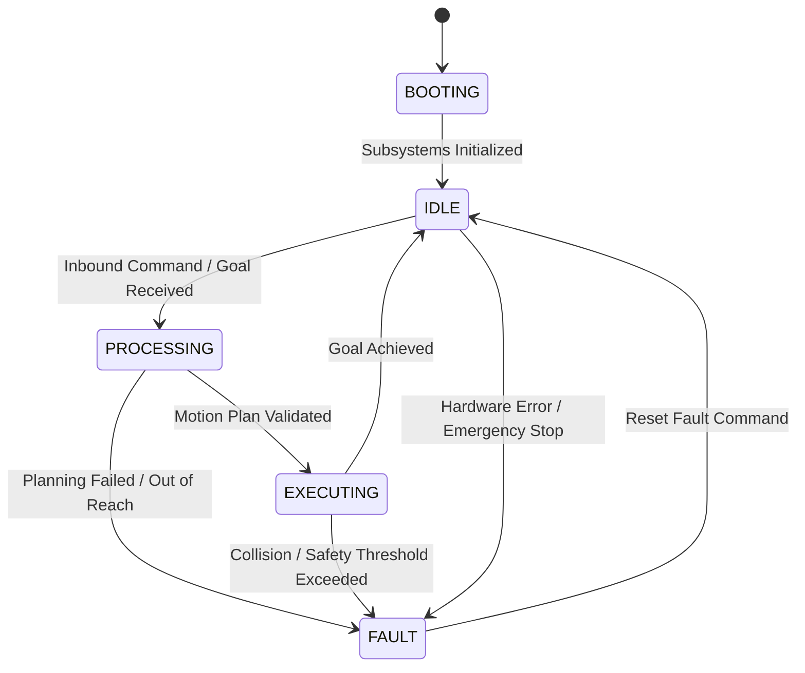
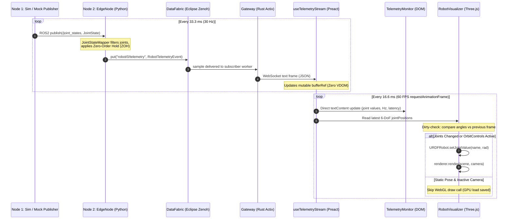
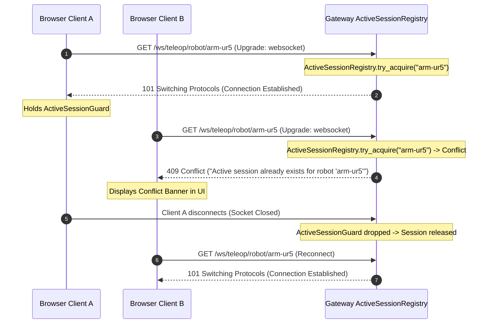

# ROS2 Robot Controller Simulation
## Comprehensive System Architecture, Hardware Models & End-to-End Data Flow

> **Project Identity**: Renamed to **ROS2 Robot Controller Simulation** (formerly referenced during initial prototyping as HandSim / arm-UR5e controller simulation).

---

## 1. Executive Summary & System Overview

The **ROS2 Robot Controller Simulation** project is an industrial-grade, distributed cloud-robotics teleoperation, real-time telemetry streaming, and simulation platform. It connects browser-based 3D visualizers and teleoperators with robotic manipulators and dexterous end-effectors running in ROS2 Jazzy Jalisco and Gazebo Harmonic.

The architecture strictly adheres to **Clean Architecture**, **Domain-Driven Design (DDD)**, and John Ousterhout’s **Deep Modules** philosophy. It decouples high-frequency robotics middleware from browser-based rendering loops through a resilient, low-latency edge gateway.

```
┌────────────────────────────────────────────────────────────────────────────────────────┐
│                                 SYSTEM TOPOLOGY                                        │
└────────────────────────────────────────────────────────────────────────────────────────┘

 [ Operator Browser ]                                  [ Linux / VM Host / Edge ]
 ┌───────────────────────────┐                         ┌─────────────────────────────────┐
 │   TeleopClient (Preact)   │                         │   EdgeNode (Python / rclpy)     │
 │  ┌─────────────────────┐  │    WebSocket (JSON)     │  ┌───────────────────────────┐  │
 │  │   RobotVisualizer   │  │   ws://localhost:8080   │  │    JointStateMapper       │  │
 │  │ (Three.js WebGL)    │  │ ◄─────────────────────► │  │    (Canonical UR5e ZOH)   │  │
 │  └─────────────────────┘  │                         │  └─────────────▲─────────────┘  │
 │  ┌─────────────────────┐  │                         │                │ ROS2 DDS       │
 │  │  TelemetryMonitor   │  │                         │                │ /joint_states  │
 │  │  (Zero-VDOM Readout)│  │                         │  ┌─────────────▼─────────────┐  │
 │  └─────────────────────┘  │                         │  │ Node 1: Motion Source     │  │
 └─────────────▲─────────────┘                         │  │ (Gazebo / Mock Publisher) │  │
               │                                       │  └───────────────────────────┘  │
               │                                       └────────────────▲────────────────┘
               │                                                        │
               │           ┌───────────────────────────────┐            │
               └──────────►│  Tier 2: Gateway (Rust Actix) │◄───────────┘
                           │ ┌───────────────────────────┐ │  Eclipse Zenoh DataFabric
                           │ │   ActiveSession Registry  │ │  robot/{id}/telemetry
                           │ └───────────────────────────┘ │  robot/{id}/command
                           └───────────────────────────────┘
```

### Three-Tier Decoupled Topology

1. **Tier 1: TeleopClient (`web/`)**:
   - Built with **Preact**, **TypeScript**, and **Three.js** (`urdf-loader`).
   - Renders a 3D kinematic model of the robot at 60 FPS adhering to ROS coordinate conventions (REP-103).
   - Decouples high-frequency telemetry ingestion via a mutable, non-reactive buffer (`useTelemetryStream`) and direct DOM updates via `requestAnimationFrame` to eliminate Virtual-DOM diffing overhead.
2. **Tier 2: Gateway (`src/gateway/`)**:
   - Built with **Rust (Edition 2021)**, **Actix-Web**, `actix-ws`, and **Tokio**.
   - Serves as the security and concurrency boundary.
   - Enforces the **ActiveSession** domain invariant: only one active teleoperator connection is permitted per robot instance at any time (returning `409 Conflict` on duplicate connections).
   - Multiplexes bidirectional WebSocket text frames ↔ Eclipse Zenoh DataFabric key expressions.
3. **Tier 3: EdgeNode & Simulation Layer (`src/edge_node/`)**:
   - Built with **Python 3.12** (managed via **uv**), native **ROS2 Jazzy Jalisco** (`rclpy`), and `eclipse-zenoh`.
   - Ingests high-frequency ROS2 DDS topics (`/joint_states`), maps named joints to canonical kinematic indices with Zero-Order Hold (ZOH), discards extraneous gripper joints, and serializes typed domain events (`RobotTelemetryEvent`) over Zenoh at a steady 30 Hz.
   - Receives inbound commands (`RobotCommand`), validates schemas, and routes execution to ROS2 action controllers and path planners.

---

## 2. Simulated Hardware & Kinematics

### 2.1 The Manipulator: Universal Robots UR5e (URe5)

The primary robotic arm simulated in the project is the **Universal Robots UR5e** (6-DoF collaborative manipulator).

```
       [wrist_3_joint] ──► [tool0 / End Flange]
              │
       [wrist_2_joint]
              │
       [wrist_1_joint]
              │
         [forearm]
              │
        [elbow_joint]
              │
        [upper_arm]
              │
     [shoulder_lift_joint]
              │
     [shoulder_pan_joint]
              │
         [base_link]
```

#### Canonical Kinematic Chain & Joint Specifications

The project establishes a canonical kinematic order defined across all languages (`CANONICAL_UR5E_JOINTS`):

| Index | Joint Identifier | Type | Parent Link | Child Link | Range Limit (rad) | Range Limit (deg) | Max Velocity (rad/s) |
|---|---|---|---|---|---|---|---|
| `0` | `shoulder_pan_joint` | Revolute | `base_link_inertia` | `shoulder_link` | $[-\pi, \pi]$ | $[-180^\circ, 180^\circ]$ | $\pi \approx 3.1416$ |
| `1` | `shoulder_lift_joint` | Revolute | `shoulder_link` | `upper_arm_link` | $[-\pi, \pi]$ | $[-180^\circ, 180^\circ]$ | $\pi \approx 3.1416$ |
| `2` | `elbow_joint` | Revolute | `upper_arm_link` | `forearm_link` | $[-\pi, \pi]$ | $[-180^\circ, 180^\circ]$ | $\pi \approx 3.1416$ |
| `3` | `wrist_1_joint` | Revolute | `forearm_link` | `wrist_1_link` | $[-\pi, \pi]$ | $[-180^\circ, 180^\circ]$ | $\pi \approx 3.1416$ |
| `4` | `wrist_2_joint` | Revolute | `wrist_1_link` | `wrist_2_link` | $[-\pi, \pi]$ | $[-180^\circ, 180^\circ]$ | $\pi \approx 3.1416$ |
| `5` | `wrist_3_joint` | Revolute | `wrist_2_link` | `wrist_3_link` | $[-\pi, \pi]$ | $[-180^\circ, 180^\circ]$ | $\pi \approx 3.1416$ |

#### 3D Visual Mesh Assets

Visual models are derived from `ur_description` Collada (`.dae`) assets, bundled statically in `web/public/models/ur_description/meshes/ur5e/visual/`:
- `base.dae`, `shoulder.dae`, `upperarm.dae`, `forearm.dae`, `wrist1.dae`, `wrist2.dae`, `wrist3.dae`.
- Loaded client-side via `urdf-loader` and Three.js `ColladaLoader` mapped to ROS package syntax (`package://ur_description/...`).

### 2.2 End-Effector: Dexterous Palm & Hand Integration

The system is designed for high-dexterity manipulation tasks combining an articulated arm with a multi-fingered hand or adaptive gripper (such as a dexterous palm, Robotiq 2F-85, or anthropomorphic hand).

#### Architectural Isolation of Gripper / Palm Joints
In ROS2, complex multi-link hands publish all their joint angles concurrently to `/joint_states` alongside the arm.
To prevent end-effector additions from breaking the core arm telemetry pipeline, the `JointStateMapper` (`src/edge_node/mapper.py`) enforces strict defensive filtering:
1. **Named Filtering**: The mapper inspects incoming joint names and extracts *only* the 6 canonical UR5e joints (`shoulder_pan_joint` through `wrist_3_joint`).
2. **Safe Discard**: Extraneous joints (such as `robotiq_85_*`, `palm_*`, `finger_*`) are safely discarded without throwing exceptions.
3. **Zero-Order Hold (ZOH)**: If a frame updates only a subset of joints, missing arm joints preserve their last valid angle.
4. **Dexterous Palm Evolution (Phases 4–5)**: End-effector actuation channels and tactile/contact telemetry mount to the UR5e flange (`tool0`) as an independent domain sub-schema without breaking the 6-DoF arm telemetry contract.

### 2.3 Coordinate Frame Conventions & Alignment

Robotics and WebGL software stacks use fundamentally different coordinate conventions:

```
    ROS REP-103                   WebGL / Three.js
      +Z (Up)                         +Y (Up)
         ▲                               ▲
         │                               │
         │                               │
         └─────► +Y (Left)               └─────► +X (Right)
        /                               /
       ▼                               ▼
     +X (Forward)                    +Z (Back / Toward Viewer)
```

- **ROS REP-103 Standard**: Right-handed Cartesian with $+X$ pointing forward, $+Y$ pointing left, and $+Z$ pointing up.
- **WebGL / Three.js Standard**: Right-handed with $+X$ pointing right, $+Y$ pointing up, and $+Z$ pointing toward the viewer.
- **System Invariant**: All coordinate transformation occurs at the Three.js root scene graph node (`web/src/components/RobotVisualizer.tsx`):
  ```typescript
  const robotGroup = new THREE.Group();
  robotGroup.name = 'robot-root';
  robotGroup.rotation.x = -Math.PI / 2; // Exact REP-103 to WebGL conversion
  scene.add(robotGroup);
  ```
- **Rule**: Never manually swizzle quaternion components ($w, x, y, z$) or invert axes inside data serialization logic.

---

## 3. ROS2 Architecture & The Two Core Nodes

Within the ROS2 ecosystem, the simulation environment is driven by two distinct nodes:

```
┌────────────────────────────────────────────────────────────────────────────────────────┐
│                                 ROS2 NODE TOPOLOGY                                     │
└────────────────────────────────────────────────────────────────────────────────────────┘

 ┌─────────────────────────────────────────────────────────┐
 │                   NODE 1: MOTION SOURCE                 │
 │   - MockMotionPublisher (Phase 1-3 Standalone)          │
 │   - or Gazebo Harmonic + ros2_control (Phase 4-5)       │
 └────────────────────────────┬────────────────────────────┘
                              │
                              │ Topic: /joint_states
                              │ Type:  sensor_msgs/msg/JointState
                              │ QoS:   Best Effort (sensor_data, depth=10)
                              │ Rate:  30 Hz
                              ▼
 ┌─────────────────────────────────────────────────────────┐
 │                     NODE 2: EDGENODE                    │
 │   - edge_node_<robot_id> (rclpy.node.Node)              │
 │   - Ingests /joint_states                               │
 │   - Normalizes canonical UR5e joints via JointStateMapper│
 │   - Exposes Zenoh DataFabric Bridge (Pub/Sub)           │
 └────────────────────────────┬────────────────────────────┘
                              │
                              │ Topic: robot/{id}/telemetry
                              │ Transport: Eclipse Zenoh
                              ▼
```

### Node 1: The Joint State / Physics Source (`MockMotionPublisher` / Gazebo)

- **Executable**: `src/edge_node/mock_motion_publisher.py` (or `mock_publisher.py`).
- **Role**: Serves as the authoritative source of joint motion and kinematics.
- **In Mock Mode (Phases 1–3)**:
  - An analytical kinematics generator runs a 30 Hz ROS2 timer.
  - Generates smooth, continuous, non-harmonic sinusoidal sweeps across all 6 joints using prime-based frequencies for rich 3D spatial coverage:
    - $\theta_{\text{pan}}(t) = 1.20 \sin(2\pi \cdot 0.11 t + 0.0)$
    - $\theta_{\text{lift}}(t) = -1.5708 + 0.70 \sin(2\pi \cdot 0.17 t + \frac{\pi}{4})$
    - $\theta_{\text{elbow}}(t) = 1.5708 + 0.90 \sin(2\pi \cdot 0.23 t + \frac{\pi}{2})$
    - $\theta_{\text{wrist1}}(t) = -1.5708 + 0.85 \sin(2\pi \cdot 0.29 t + \frac{3\pi}{4})$
    - $\theta_{\text{wrist2}}(t) = 1.10 \sin(2\pi \cdot 0.37 t + \frac{\pi}{3})$
    - $\theta_{\text{wrist3}}(t) = 1.35 \sin(2\pi \cdot 0.43 t + \frac{\pi}{6})$
  - Clamps all values to physical limits $[-\pi, \pi]$ and calculates instantaneous velocities $\dot{\theta}_i(t)$.
  - Constructs `sensor_msgs/msg/JointState` with `header.stamp`, `name`, `position`, `velocity`, and zero `effort`.
- **In Full Simulation Mode (Phases 4–5)**:
  - Replaced by **Gazebo Harmonic (GZ Sim)** solving rigid-body dynamics and contact physics.
  - Joint positions are published by `joint_state_broadcaster` interfacing with `gz_ros2_control`.

### Node 2: The Edge Ingestion & Bridge Node (`EdgeNode`)

- **Executable**: `src/edge_node/main.py` (`EdgeNode` in `src/edge_node/node.py`).
- **Role**: Bridges the local ROS2 DDS network with the external Eclipse Zenoh DataFabric.
- **Responsibilities**:
  1. **ROS2 Subscription**: Subscribes to `/joint_states` with sensor data QoS (`rclpy.qos.qos_profile_sensor_data`).
  2. **Canonical Mapping**: Calls `JointStateMapper.update_from_joint_state(msg)`. Updates internal thread-safe position vectors, discards extraneous links, and ignores non-finite (`NaN` / `Inf`) data.
  3. **Periodic Telemetry Emission**: Runs a high-precision 30 Hz ROS2 timer (`publish_telemetry_tick`) that reads the current joint positions, stamps them with nanosecond epoch time, sets `robot_state=RobotState.IDLE` (or `EXECUTING`), and publishes a typed `RobotTelemetryEvent` over Zenoh to `robot/{id}/telemetry`.
  4. **Command Subscription**: Declares a Zenoh subscriber on `robot/{id}/command`. Validates inbound JSON payloads against `RobotCommand` schema. When a `PING` or motion command arrives, executes node actions and publishes an immediate acknowledgment telemetry event.

---

## 4. Under the Hood: Motion, Positioning & Actuation

### 4.1 What Makes the Arm Act?
The motion of the arm transitions through several layers depending on the operating mode:

```
[ Operator Command ]
        │ (WebSocket)
        ▼
   [ Gateway ]
        │ (Zenoh: robot/{id}/command)
        ▼
   [ EdgeNode ]
        │
        ├──► [ Teleop Joint Target ] ──► ros2_control (Forward Command Controller)
        │
        └──► [ Cartesian Goal ]      ──► MoveIt2 (OMPL: RRTConnect / Trajectory Planner)
                                                │
                                                ▼
                                         JointTrajectoryController
                                                │ (PID Effort / Position)
                                                ▼
                                         Gazebo Physics Engine
                                                │
                                                ▼
                                         /joint_states (30 Hz)
```

1. **Analytical Mock Motion (Phases 1–3)**:
   - Evaluates closed-form trigonometric equations $f(t)$ inside `mock_motion_publisher.py`.
   - Bypasses physics simulation while exercising the 30 Hz ROS2 publisher, QoS contracts, mapping layers, Zenoh data fabric, and 60 FPS WebGL rendering.
2. **Closed-Loop Controller Actuation (Phases 4–5)**:
   - **`ros2_control` Framework**: Loads controller plugins configured for UR5e:
     - `joint_state_broadcaster`: Queries simulated hardware interfaces and emits `/joint_states`.
     - `joint_trajectory_controller`: Ingests multi-point cubic or quintic splines (`trajectory_msgs/msg/JointTrajectory`) with explicit velocity and acceleration boundary constraints.
   - **MoveIt2 Motion Planning**:
     - Calculates Inverse Kinematics (IK) using KDL or PickNik BIO-IK.
     - Plans collision-free paths around obstacle geometry using OMPL algorithms (e.g., RRTConnect, PRM*).
     - Emits joint trajectories to the controller action server (`/joint_trajectory_controller/follow_joint_trajectory`).

### 4.2 Positioning & Kinematics Control Loop

The lifecycle state machine of the robot strictly tracks its operational condition:



- **`BOOTING`**: System initialization, verifying ROS2 topics, loading URDF meshes, declaring Zenoh endpoints.
- **`IDLE`**: Ready to receive commands; continuous 30 Hz zero-state or hold-position telemetry streaming.
- **`PROCESSING`**: Evaluating inbound target, computing inverse kinematics or ONNX object detection.
- **`EXECUTING`**: Active joint trajectory execution or continuous teleoperation streaming.
- **`FAULT`**: Emergency stop triggered, joint limit breach, or hardware fault. Motion halted.

---

## 5. Protocols, Wire Schemas & Data Formats

### 5.1 Protocol Hierarchy

```
┌────────────────────────────────────────────────────────────────────────────────────────┐
│                                   PROTOCOL STACK                                       │
└────────────────────────────────────────────────────────────────────────────────────────┘

 Layer                   Protocol           Payload Format            Endpoint / Channel
 ───────────────────────────────────────────────────────────────────────────────────────
 Client ↔ Gateway        WebSocket (TCP)    Serde JSON                ws://host:8080/ws/teleop/robot/{id}
 Gateway ↔ EdgeNode      Eclipse Zenoh      Zero-Copy JSON            robot/{id}/telemetry
                                                                      robot/{id}/command
 EdgeNode ↔ ROS2         DDS (RTPS/UDP)     sensor_msgs/JointState    /joint_states
 System Diagnostics      HTTP / REST        JSON                      http://host:8080/health
```

### 5.2 Canonical Domain Schemas

Wire schemas are centrally locked in `schemas/` and auto-generated across Python (`src/domain/domain.py`), Rust (`src/domain/domain.rs`), and TypeScript (`web/domain/contracts.ts`) via `scripts/generate_domain.py`.

#### 1. Inbound Command: `RobotCommand` (`schemas/robot_command.schema.json`)
```json
{
  "command_id": "7f8b9c2a-1e4d-4b8c-9a1f-8e2d3c4b5a6f",
  "sender_id": "ui-client",
  "timestamp_ns": 1726265566000000000,
  "type": "PING",
  "payload": {}
}
```
- Supported `CommandType` values: `PING`, `TELEOP_JOINT_TARGET`, `TRAJECTORY_EXECUTE`, `EMERGENCY_STOP`, `RESET_FAULT`.

#### 2. Outbound Telemetry Event: `RobotTelemetryEvent` (`schemas/robot_telemetry_event.schema.json`)
```json
{
  "timestamp_ns": 1726265566033333333,
  "robot_state": "IDLE",
  "joint_positions": [0.0, -1.5708, 1.5708, -1.5708, 0.0, 0.0],
  "inference_metrics": null,
  "command_id": "7f8b9c2a-1e4d-4b8c-9a1f-8e2d3c4b5a6f"
}
```
- `joint_positions`: Exactly 6 floating-point values in radians representing the UR5e joints in canonical sequence.
- `inference_metrics`: Reserved for Phase 4 ONNX vision outputs (`latency_ms`, `confidence`, `detected_object`).
- `command_id`: Populated when acknowledging a specific command.

#### 3. Diagnostic Error Frame: `ErrorFrame` (`schemas/error_frame.schema.json`)
```json
{
  "type": "ERROR",
  "error_code": "SCHEMA_VALIDATION_ERROR",
  "message": "Malformed RobotCommand payload: missing field `command_id`",
  "timestamp_ns": 1726265566050000000
}
```
- **Error Semantics**: Validation errors return structured `ERROR` frames over WebSocket without disconnecting the client.

---

## 6. End-to-End Data Flow (Step-by-Step Sequences)

### Sequence A: 30 Hz Telemetry Ingestion & 60 FPS WebGL Rendering

This flow details how joint motions in the simulation propagate through to the operator's display:



#### Step-by-Step Breakdown:
1. **Simulation Step**: At $30\text{ Hz}$, the simulation source publishes `sensor_msgs/msg/JointState` to `/joint_states`.
2. **Defensive Extraction**: `EdgeNode.on_joint_state()` invokes `JointStateMapper`. It extracts the 6 canonical joints by name, preserves missing values via ZOH, ignores extraneous joints (gripper), and rejects non-finite floats.
3. **DataFabric Put**: The 30 Hz timer in `EdgeNode` serializes `RobotTelemetryEvent` and emits it to Zenoh topic `robot/{id}/telemetry`.
4. **Gateway Multiplexing**: The Tokio async worker in `ZenohFabric` receives the sample, passes it to the `broadcast` channel, and writes the JSON string to the active WebSocket session.
5. **Non-Reactive Ingestion**: In the browser, `useTelemetryStream` receives the frame, parses JSON, and updates `bufferRef.current` synchronously without triggering a Preact re-render.
6. **Direct DOM Paint**: `TelemetryMonitor` uses direct DOM element references inside `requestAnimationFrame` to write formatted radians and degrees directly to text nodes.
7. **Dirty-Checked 3D Render**: `RobotVisualizer` checks if angles have changed since the last frame. If dirty, it applies `setJointValue()` to each kinematic link and renders the Three.js scene. If static, it skips rendering to prevent GPU load.

---

### Sequence B: Operator Command Dispatch & Acknowledgment

This flow details how an operator command travels from the browser UI to the robot and triggers an acknowledgment:

```mermaid
sequenceDiagram
    autonumber
    participant UI as TeleopClient UI
    participant GW as Gateway (Rust Actix)
    participant Zenoh as DataFabric (Eclipse Zenoh)
    participant Edge as EdgeNode (Python)
    participant ROS as ROS2 Middleware / Node

    UI->>GW: WebSocket.send(RobotCommand JSON)
    Note over GW: Serde deserializes & validates schema

    alt Schema Valid
        GW->>Zenoh: put("robot/0/command", RobotCommand)
        Zenoh->>Edge: Subscriber callback receives sample
        Edge->>Edge: Pydantic validates RobotCommand
        Edge->>ROS: node.get_logger().info() or Action Client
        Edge->>Zenoh: put("robot/0/telemetry", Ack RobotTelemetryEvent)
        Zenoh->>GW: Forward Ack Event
        GW->>UI: WebSocket text frame
        UI->>UI: Append confirmation to Real-Time Event Log
    else Schema Invalid
        GW-->>UI: WebSocket.send(ErrorFrame JSON)
        Note over UI: Logs structured error; connection remains open
    end
```

#### Step-by-Step Breakdown:
1. **Operator Trigger**: Operator clicks a button (e.g., "Verify Connection (Ping)" or sends a teleop trajectory).
2. **Command Serialization**: The browser constructs a `RobotCommand` with a unique UUID v4 and timestamp.
3. **Gateway Inspection**: Gateway receives the text frame and parses it using `serde_json`. If invalid, it sends a structured `ErrorFrame` back without terminating the socket.
4. **DataFabric Routing**: Gateway publishes the valid command to Zenoh topic `robot/{id}/command`.
5. **EdgeNode Execution**: `EdgeNode._on_zenoh_sample()` deserializes the command via Pydantic. It logs the receipt in the native ROS2 logger and dispatches actions to ROS2 controllers.
6. **Telemetry Ack**: EdgeNode immediately creates a `RobotTelemetryEvent` containing `command_id = command.command_id` and publishes it to `robot/{id}/telemetry`.
7. **UI Notification**: The acknowledgment travels back through Gateway to the browser WebSocket, appending a verified telemetry event entry into the UI event log.

---

### Sequence C: Gateway ActiveSession Gating (Concurrency Control)

To prevent multiple operators from sending conflicting teleoperation commands to a single robot, the Gateway enforces mutual exclusion:



---

## 7. Performance & Hardware Optimizations

Because **ROS2 Robot Controller Simulation** is engineered to run in constrained virtualization environments (e.g., Ubuntu 24.04 inside VirtualBox with integrated GPUs such as AMD Radeon 780M without proprietary NVIDIA CUDA acceleration), multiple performance safeguards are implemented:

1. **Zero-VDOM Rendering Pipeline**:
   - High-frequency 30 Hz updates never enter Preact's component state tree.
   - Using direct DOM references and `useRef`, numerical readouts are updated directly via `element.textContent`, preventing CPU thread stutter and GC pauses.
2. **Dirty-Checked Three.js Render Loop**:
   - The Three.js WebGL renderer only issues draw calls (`renderer.render(scene, camera)`) when joint angles actually change or when the user interacts with `OrbitControls`.
   - Idle scenes consume approximately 0% GPU utilization.
3. **Zero-Order Hold (ZOH) Robustness**:
   - If network frames are delayed or arrive out of order, the kinematics chain does not snap or collapse to origin; it latches to the most recent known valid coordinate.
4. **Memory Management & Leak Prevention**:
   - Comprehensive component unmount lifecycle in `RobotVisualizer.tsx`: disposes all `BufferGeometry`, materials, textures, controls, observers, and explicitly forces WebGL context loss (`renderer.forceContextLoss()`).
5. **Headless Physics & Simulation**:
   - Gazebo Harmonic runs headless (`--headless-rendering`) on the host/VM, transmitting only lightweight kinematic vectors over DDS and Zenoh, leaving visual rendering entirely to the client's WebGL canvas.

---

## 8. Summary of Components & File Locations

| Subsystem | Primary Files | Description |
|---|---|---|
| **Schemas** | `schemas/robot_command.schema.json`<br>`schemas/robot_telemetry_event.schema.json`<br>`schemas/error_frame.schema.json` | Single source of truth defining cross-language wire contracts. |
| **Code Generation** | `scripts/generate_domain.py` | Generates Rust Serde types, Python Pydantic models, and TypeScript contracts. |
| **EdgeNode** | `src/edge_node/main.py`<br>`src/edge_node/node.py`<br>`src/edge_node/mapper.py` | ROS2 node & Zenoh client; maps joint states and handles inbound commands. |
| **Mock Motion** | `src/edge_node/mock_motion_publisher.py`<br>`src/edge_node/mock_publisher.py` | Standalone 30 Hz dynamic sinusoidal trajectory generator for UR5e. |
| **Gateway** | `src/gateway/src/main.rs`<br>`src/gateway/src/ws.rs`<br>`src/gateway/src/session.rs`<br>`src/gateway/src/fabric.rs` | Rust Actix-Web WebSocket service, session gating, and Zenoh multiplexer. |
| **TeleopClient** | `web/src/components/TeleopClient.tsx`<br>`web/src/components/RobotVisualizer.tsx`<br>`web/src/components/TelemetryMonitor.tsx` | Preact dashboard, Three.js 3D WebGL viewport, zero-VDOM telemetry readout. |
| **Robot Models** | `web/public/models/ur5e/ur5e.urdf`<br>`web/public/models/ur_description/` | Extracted UR5e URDF definition and Collada visual mesh files. |
| **Specifications** | `support_files/specs/units.md`<br>`support_files/specs/technologies.md`<br>`support_files/specs/dev_phases.md` | Specification-driven development roadmaps and architectural units. |
